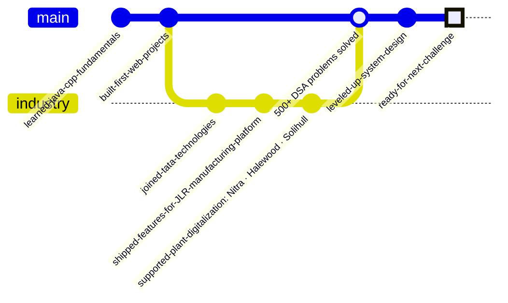
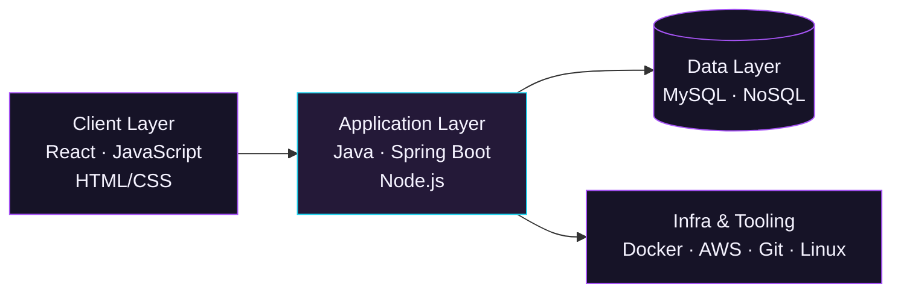

## Hi there 👋

<!--
**imravianand/imravianand** is a ✨ _special_ ✨ repository because its `README.md` (this file) appears on your GitHub profile.

Here are some ideas to get you started:

- 🔭 I’m currently working on ...
- 🌱 I’m currently learning ...
- 👯 I’m looking to collaborate on ...
- 🤔 I’m looking for help with ...
- 💬 Ask me about ...
- 📫 How to reach me: ...
- 😄 Pronouns: ...
- ⚡ Fun fact: ...
-->

  

 

## → about

I build backend systems the way I solve DSA problems — look for the cleanest path, then make it production-ready.

Ex-**Software Engineer at Tata Technologies**, where I worked inside the systems that keep a Jaguar Land Rover plant running. Now heads-down on Java, Spring Boot, and system design — getting ready for what's next.

 

## → career, as commits

 

## → experience

**Software Engineer** · Tata Technologies — *client: Jaguar Land Rover*
`Aug 2022 – Nov 2023`

- Worked on the **CIMPLICITY-based manufacturing monitoring platform** supporting live vehicle-plant operations
- Contributed to digitalization of manufacturing processes across JLR plants in **Nitra, Halewood, and Solihull**
- Partnered with cross-functional teams to scope requirements, ship changes, and resolve production issues
- Improved system stability through bug fixes, configuration tuning, and performance optimization
- Operated under enterprise **SDLC & Agile** practices in a live production environment

 

## → how I build

 

## → projects

**COVID-19 Information & Resource Aggregation Platform**
`Node.js` `JavaScript`
Aggregation platform consolidating verified COVID-19 data — symptoms, prevention, vaccination, and case updates — pulled and merged from multiple public sources in real time. Built for reliability, modularity, and public-health usability.
[→ view repo](https://github.com/imravianand)

**Realtime Collaborative Whiteboard**
`JavaScript` `HTML/CSS` `Node.js`
Web-based whiteboard for real-time multi-user drawing, using event-driven sync to keep every canvas action live across sessions. Undo/redo built in for finer user control.
[→ view repo](https://github.com/imravianand)

> *Swap in your real repo links here once these are pushed to the new account — this is the first thing a recruiter clicks.*

 

## → activity

 

## → reach me

`imravianand@LinkedIn` → https://www.linkedin.com/in/imravianand/
`ravianandfbg@gmail.com` → open to SDE / Software Engineer roles

 

  building reliable systems, one commit at a time

